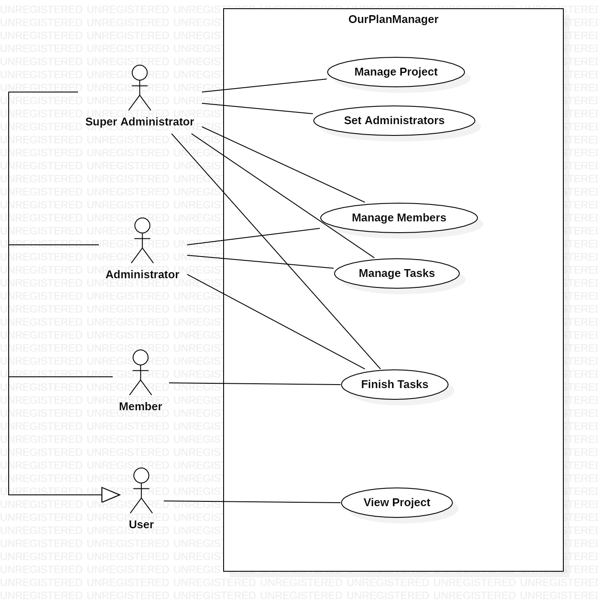
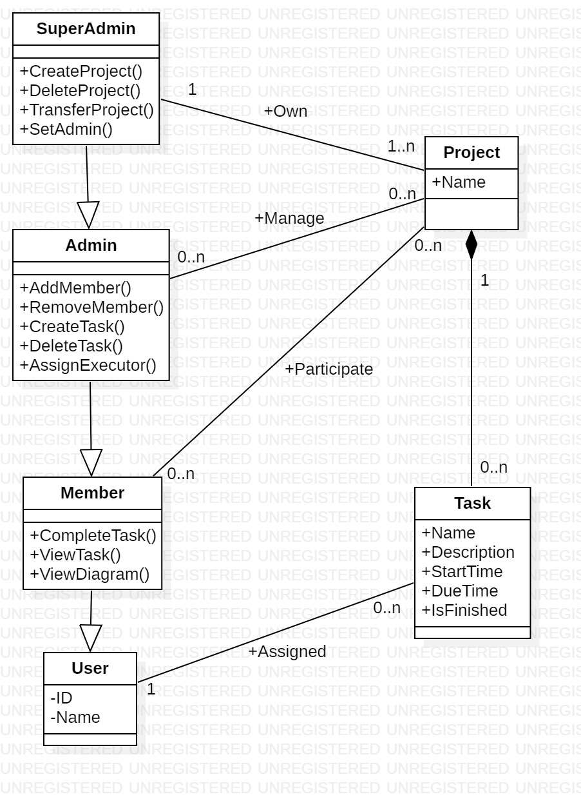
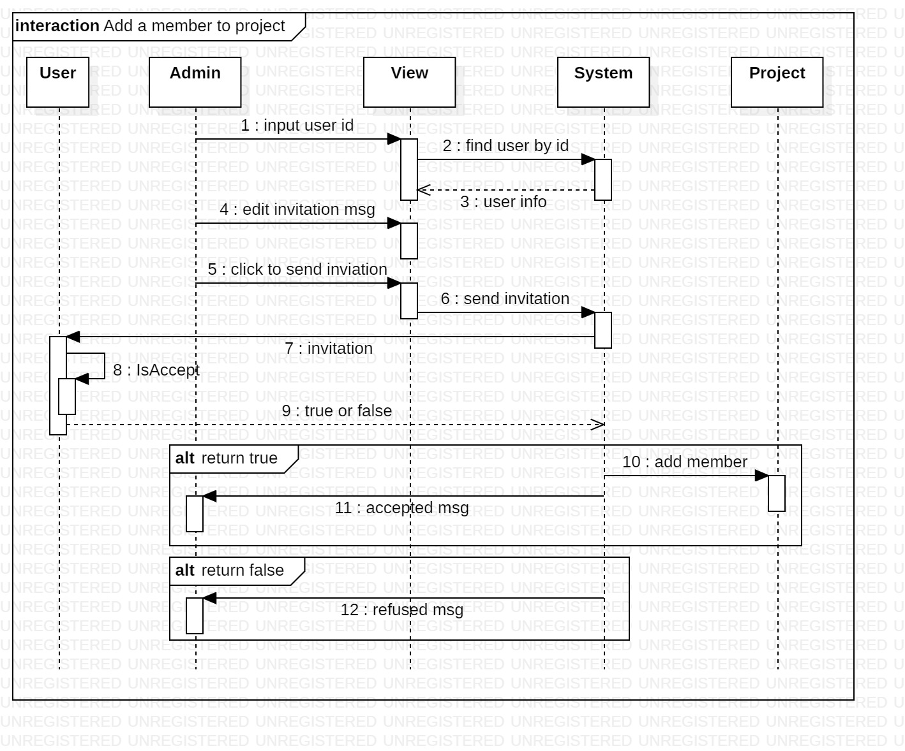
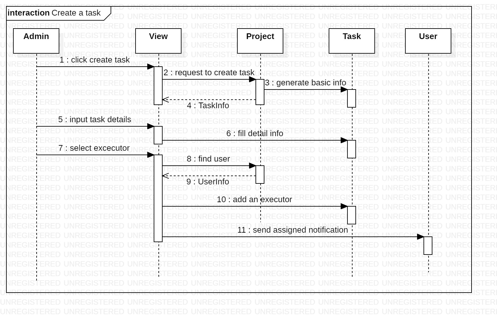

# 项目选题
项目名称：OurProjectManager——多人协作的任务管理软件

该软件可用于项目小组的协作。与其他任务管理软件相比，该软件具有以下特点：

- 用户数量从一人扩展到多人。
- 针对多人协作的使用场景优化。
    - 三种角色：项目主管、管理员、项目成员。不同的角色具有不同的权限。
    - 两级结构：项目、任务。一个项目可包含多个任务。

# 小组成员
- 朱华彬
- 董晓艺
- 谢可睿

# 需求描述
OurProjectManager 是一款多人协作的任务管理软件。

项目是团队协作的基本单位。同一项目中的成员可以借助本软件分配任务、开展讨论、查看项目进度。本软件将为用户提供待办事项、统计图表等工具，帮助用户更好地开展工作。

每个项目可包含多个任务。每个任务就是一项待办事项，具有标题、描述、完成情况等信息。

每个项目有一名主管、若干管理员、若干成员，不同角色具有不同的权限。项目的创建者将默认成为该项目的管理员。

| 功能 / 角色      | 主管  | 管理员 | 成员  |
| ---------------- | :---: | :----: | :---: |
| 创建项目         |   ✔️   |   ❌    |   ❌   |
| 删除项目         |   ✔️   |   ❌    |   ❌   |
| 转让项目         |   ✔️   |   ❌    |   ❌   |
| 设置管理员       |   ✔️   |   ❌    |   ❌   |
| 添加成员         |   ✔️   |   ✔️    |   ❌   |
| 删除成员         |   ✔️   |   ✔️    |   ❌   |
| 创建任务         |   ✔️   |   ✔️    |   ❌   |
| 删除任务         |   ✔️   |   ✔️    |   ❌   |
| 为任务指派执行人 |   ✔️   |   ✔️    |   ❌   |
| 完成任务         |   ✔️   |   ✔️    |   ✔️   |
| 查看任务         |   ✔️   |   ✔️    |   ✔️   |
| 查看统计图表     |   ✔️   |   ✔️    |   ✔️   |

# 用例图

# 类图

# 时序图
## 添加成员

## 添加任务
